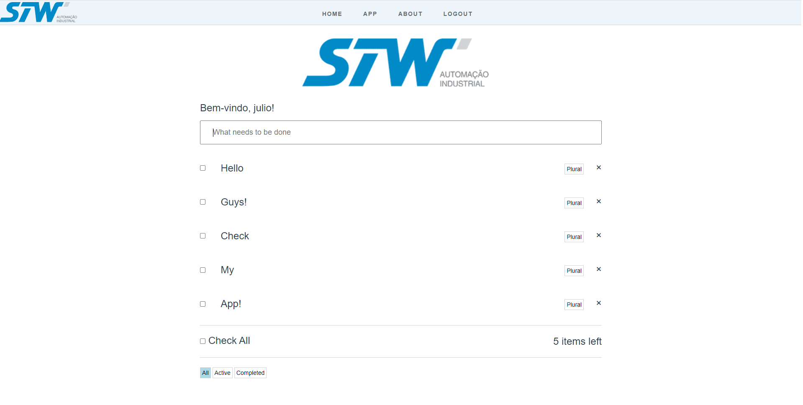

# Todo-List-Front




> Todo App front-end made with Vue 3 with the purpose of learning new technologies.

## ⚙️ Technologies

- HTML
- CSS
- Git
- Vue
- Vuex
- VueRouter
- Axios

## 📞 Contact

julio.schmidt@universo.univates.br


## 💻 Pre Requirements

Before starting, verify if you meet the requirements:
* You have installed the most recent version of `<Node / Vue>`.
* You have a machine with `<Windows / Linux / Mac>` operational system.


## 🚀 Project Setup

```sh
npm install
```

## ☕ Use Todo-List-Front

```sh
npm run dev
```

## 🔨 Compile Todo-List-Front

```sh
npm run build
```

## Todo-Laravel
In order to run the full application, make sure you have the [TODO-LARAVEL](https://github.com/julioschmidt/todo-laravel) configured and running

[⬆ Back to the top](#todo-list-front)<br>
